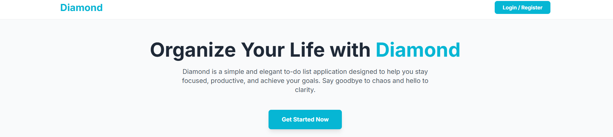

# <b>Diamond: A to-do list application</b>
Diamond is a website focused in to-do funcionality. It includes a login system, administrator panel, creation of different tasks to do in an especific day, a weekly routine creation to manage what you need to do all week, and a lot more!

<div align="center">
	
</div>

## How it works
This project was made with Python, Flask to start a http server, sqlalchemy for database administration.
The front was made with basic HTML/CSS/JS.

## How to run
In order to run it, you need to have <b>python 3.x</b>, and <b>git</b>.
The following sequence of commands will activate the server in the <b>5000</b> port. It's recommend to use git bash.


```bash
# Cloning The Project
git clone https://github.com/Zastetic/Diamond.git
cd Diamond

# Creating Python Virtual Environment
python -m venv venv
source venv/Scripts/activate

# Installing Dependencies
pip install -r requirements.txt

# Start The Server
python app.py

```
